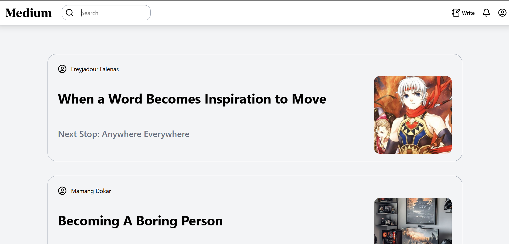

# Basic React Project Medium

This project is for training only. Through this project, we learn to useNavigate and useParams on React-Router-DOM to switching pages.

## Preview



## How to Run this Project

1. Clone this project
```
git clone https://github.com/mdavindarinaldy/fgo24-react-medium.git
```
2. Install dependencies
```
npm install
``` 
3. Run the project
```
npm run dev
```
4. Project will running on http://localhost:5173

## Dependencies
This project using node.js to run, make sure to install node on your machine. Other than that, this project also using Vite, React, React Router DOM and ESLint.

## Basic Information
This project is part of training in Kodacademy Bootcamp Batch 24 made by Muhammad Davinda Rinaldy

## Image References
1. Jean Gunnhildr: https://www.worldanvil.com/w/toriel-elektriik/a/jean-gunnhildr-person-1
2. Edward Elric: https://aminoapps.com/c/fullmetal-alchemist/page/blog/sceney-sunday-spoilers-ahead/5njJ_08CVuL1aDDd0nZa8RPW757YYKrV48
3. Freyjadour Falenas: https://www.idntimes.com/tech/games/mito-rudito/daftar-protagonis-game-suikoden-c1c2
4. Po The Dragion Warrior: https://x.com/mrwolfofficial_/status/1727873058613125413?lang=id
5. Astrid Hofferson: https://www.dreamworks.com/how-to-train-your-dragon/explore/astrid
6. Computer Setup: https://pin.it/25Njd0waH
